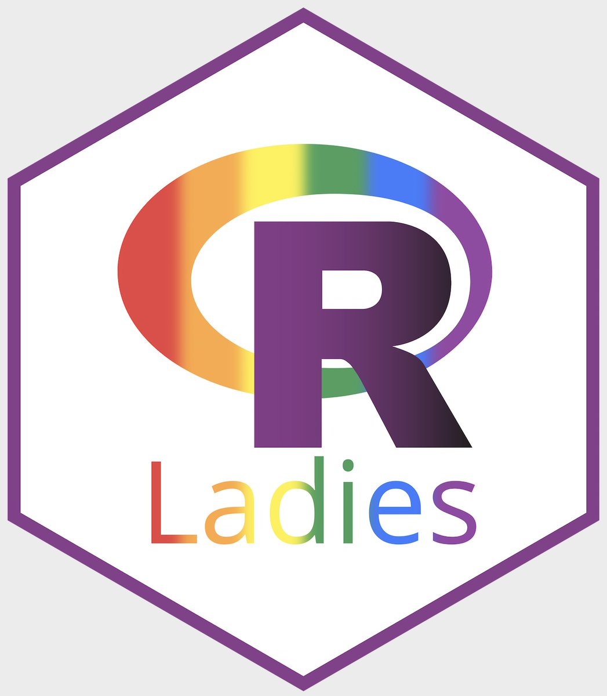

```{r setup, include=FALSE}
options(htmltools.dir.version = FALSE)
knitr::opts_chunk$set(collapse = TRUE,
                      fig.retina = 3)

library(ymlthis)
library(tidyverse)
library(xaringanExtra)
library(emoji)
xaringanExtra::use_xaringan_extra(include = c("panelset", "tile_view", "share_again"))
xaringanExtra::use_share_again()
xaringanExtra::style_share_again(
  share_buttons = c("twitter", "linkedin", "pocket")
)
```

```{r meta, echo=FALSE}
library(metathis)
meta() %>%
  meta_general(
    description = "Empower Talk",
    generator = "xaringan and remark.js"
  ) %>% 
  meta_name("github-repo" = "sciencificity") %>% 
  meta_social(
    title = "Learning in a Community",
    url = "https://...",
    image = "images/jon-tyson-8NGWDex9qUw-unsplash.jpg",
    image_alt = "a photo with a mat that shows the words 'come as you are' from unsplash",
    og_type = "website",
    twitter_card_type = "summary_large_image"
  )
```

class: title-slide, left, middle

# `r rmarkdown::metadata$title`

## `r rmarkdown::metadata$subtitle`

### `r rmarkdown::metadata$author`

---

name: clouds
background-image: url(images/clouds.jpg)
background-size: cover
class: middle, center

```{css, echo=FALSE}
.panelset {
  --panel-tab-font-family: Work Sans;
  --panel-tab-background-color-active: #fffbe0;
  --panel-tab-border-color-active: #023d4d;
}

.panelset .panel-tabs .panel-tab > a {
	color: #023d4d;
}
```


# Who am I?

.column[

]

.column[

]

.column[

]

.column[

]


???
- A nerd, and a proud R loving nerd at that
- Co-organiser of RLadies Johannesburg - what is R? RLadies ...
R is a programming language and people often refer to it as a statistical programming language. It is that but I would argue it is a language that can be used by people in many disciplines. For analysis purposes it can be used to get a better look at your data, reproduce research etc. 
RLadies is an organisation dedicated to increasing gender diversity in the R ecosystem whether this be using it for your analyses, or going further and presenting at conferences, sharing your work via blogs and books, or developing packages which are little self contained functionality that enhances the R ecosystem.
- I'm a mum and that often means visiting some far out places


---

name: clouds
background-image: url(images/clouds.jpg)
background-size: cover
class: middle, center


# Who are you?

<div class="flex" style="margin: 0 1em;">
  <div class="column">
    <h3> You're on a journey <h3>
    
  </div>

???
But ...  in a vast new world ... It can be daunting
--

   <div class="column"style="margin: 0 1em;">
    <h3> You love technology </h3>
    
  </div>
  

???

You love technology and the increased productivity it has given you as well as the increased connection with people near and far


--

   <div class="column"style="margin: 0 1em;">
    <h3> You're needed in tech spaces </h3>
    
  </div>
  

???

I'd argue tech spaces need you - people from social sciences and humanity desperately


---

class: middle, left, pink
background-image: url(images/warren-wong-q5QXU-97_i0-unsplash.jpg)
background-position: right bottom
background-size: 50%


## My journey into tech<br> started off `r emoji("broken_heart")` `r emoji("scream")`<br> but ends up `r emoji("adore")` `r emoji("love_letter")` 


???
I actually went to university to study chemical engineering
but I failed technical drawing, and I also was not doing
so great at other subjects that was usually my forte for example
physics. So I had to make the decision to quit and change degrees - I was stong at Maths so I decided that would be one part of my degree and programming was also starting to become more prevalent a vocation so I thought let me try CS 1. I fell in love immediately. I felt like a wizard and a detective all in one. I think it spoke to the lazy part of me - automating things freed up time for other passions, and I loved that code could do that for me.

---

class: middle, left, pink
background-image: url(images/door.jpg)
background-position: right top
background-size: 12%

## Little did I know that the hard work<br> had yet to start

.pull-left[

]

.pull-right[

]

???
The tech world is, to put it mildly, not really inviting for women or minority genders. If you can't see the pic on the right shows a sign in the door that says "we are open the door is just very heavy". And that is how tech spaces feel, it's a brotopia. As a woman or minority gender we often feel like the gif on the left which shows Judy disappearing when she sits down, and while we don't really want to loom over everyone like the gif on the right shows we kinda want to be somewhere in the middle.

---

class: middle, left, pink
background-image: url(images/door.jpg)
background-position: right top
background-size: 12%

## But let's not pretend ...

Your foray into tech / digital spaces is going to be even harder than mine!

.pull-left[

]

.pull-left[
- Which is why I would encourage you to join communities `r emoji("busts_in_silhouette")`  `r emoji("busts_in_silhouette")` `r emoji("busts_in_silhouette")`.
- And while I would love if you choose to join [R-Ladies](https://bit.ly/rladies-jozi-meetup-page) there are many other communities that may be suitable for you:
  * [Digital Humanities Slack Space](dhcssza.slack.com)
  * [The Carpentries](https://carpentries.org/)
  * [R4DS - R for Data Science Slack community](http://r4ds.io/join)
- I have heard it described as "free night school".
]

???
- These spaces truly feel like there are no stupid questions.
- You will find people being vulnerable, and that gives you permission to be vulnerable too.
- You will find lots of people from non-tech backgrounds learning out loud, and doing incredible things with tech because they combine their humanities background with analysis and research and product building that benefits society.

---

class: middle, left, pink
background-image: url(images/providence-doucet-mE5MBZX5sko-unsplash.jpg)
background-position: right top
background-size: 12%

## Benefits

- Learn for free. E.g. many meetups on [Meetup.com](https://www.meetup.com/).
- Meet new people from diverse backgrounds.
- Get a job.
- Find a mentor (early career), or be a mentor (good prep for leadership roles).
- Talk through usually hard to talk about subjects:
      * What's an appropriate salary for someone with X years experience in Y industry?
      * How to negotiate for a better offer / salary etc.?
      * Use a peer as a sounding board before the real deal.
- Apply for diversity scholarships - have community proof read and critique application.
- Use the safe space of the meetup to dry-run upcoming talks.
- Be invited to:
    * give talks at conferences.
    * host conference sessions.
    * co-organise conference.
- Give back.

---

class: middle, left, pink
background-image: url(images/shane-rounce-DNkoNXQti3c-unsplash.jpg)
background-position: right top
background-size: 12%

## Benefits (continued)

#### Feel supported, inspired and uplifted
#### Feel like you've found your village


???
Are there any down sides? If you suffer, like me, from social anxiety then it can be really daunting to feel safe in any space. You worry about many different things - for e.g. I often worry about my conversational skills, my likeability, my knowledge, etc.
But I do it, and get out there because the plusses outweigh the minuses

---

class: middle, left, pink
background-image: url(images/door.jpg)
background-position: right top
background-size: 12%

## Everyone knows more than me 


.pull-left[

]

.pull-left[

]

???

---

# Acknowledgements

---

# Resources

- [R-Ladies community slack](https://rladies-community-slack.herokuapp.com)
- [R-Ladies Global YouTube]()
- [Coding Club](https://ourcodingclub.github.io/)
- [Psych R Resources](https://psyteachr.github.io/): Resources from the Psychology Modules at the University of Glasgow to use R.
- [Big Book of R](https://www.bigbookofr.com/): Find books and resources in a wide variety of disciplines.


<!-- Photo by <a href="https://unsplash.com/@providence?utm_source=unsplash&utm_medium=referral&utm_content=creditCopyText">Providence Doucet</a> on <a href="https://unsplash.com/s/photos/community?utm_source=unsplash&utm_medium=referral&utm_content=creditCopyText">Unsplash</a> -->

<!-- Photo by <a href="https://unsplash.com/@shanerounce?utm_source=unsplash&utm_medium=referral&utm_content=creditCopyText">Shane Rounce</a> on <a href="https://unsplash.com/s/photos/community?utm_source=unsplash&utm_medium=referral&utm_content=creditCopyText">Unsplash</a> -->